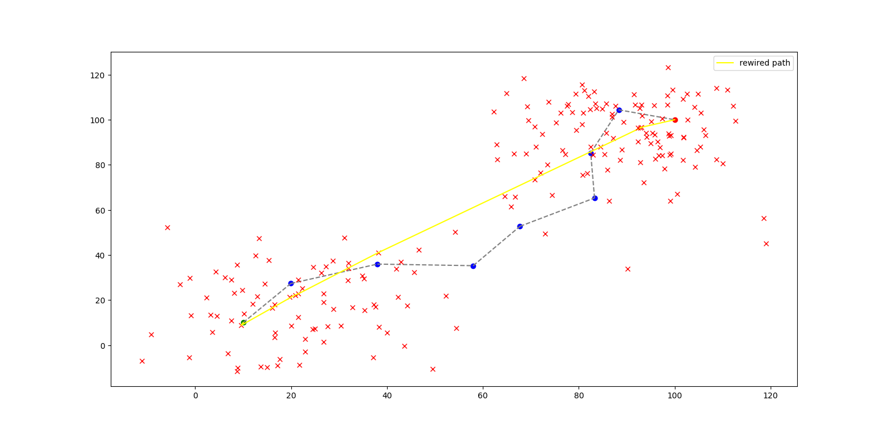

# rrt-variations

*RRT-Star Rewired Path*

TODO:

1. Sample goal node intermittently to converge faster

2. Make __eq__ function for the Node class (or just use a dataclass)

3. Doc strings for all methods

4. Break up rewire method into saller methods.
